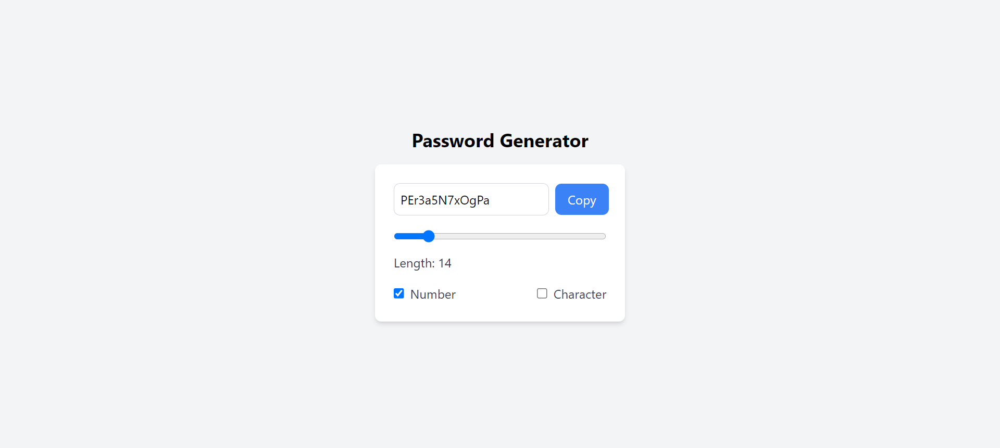

# Password Generator App

This is a simple **Password Generator** application built using **React**. It allows users to generate random passwords based on their preferences, such as password length, inclusion of numbers, and special characters. The generated password can be copied to the clipboard with a single click.

---

## Features

- **Customizable Password Length**: Users can set the password length using a slider (range: 8 to 50).
- **Include Numbers**: Users can choose to include numbers in the generated password.
- **Include Special Characters**: Users can choose to include special characters (e.g., `!@#$%^&*?/`) in the generated password.
- **Copy to Clipboard**: The generated password can be copied to the clipboard with the click of a button.

---

## Technologies Used

- **React**: A JavaScript library for building user interfaces.
- **Tailwind CSS**: A utility-first CSS framework for styling the application.
- **React Hooks**: `useState`, `useEffect`, and `useCallback` for managing state and side effects.

---

## How It Works

1. **Password Generation**:
   - The password is generated based on the selected options:
     - Length of the password (8 to 50 characters).
     - Inclusion of numbers (optional).
     - Inclusion of special characters (optional).
   - The password is generated using a random selection of characters from a predefined string.

2. **Copy to Clipboard**:
   - The generated password can be copied to the clipboard using the "Copy" button.

3. **Dynamic Updates**:
   - The password is regenerated automatically whenever the user changes the length, toggles numbers, or toggles special characters.

---

## Installation

To run this project locally, follow these steps:

1. **Clone the Repository**:
   ```bash
   git clone https://github.com/zeeshan2002/password-generator
   cd password-generator
   ```

2. **Install Dependencies**:
   ```bash
   npm install
   ```

3. **Run the Application**:
   ```bash
   npm run dev
   ```

4. **Open in Browser**:
   - The application will open in your default browser at `http://localhost:5173`.

---

## Code Structure

- **App.js**: The main component that contains the logic for generating passwords and managing user inputs.
- **Tailwind CSS**: Used for styling the application. The styles are applied using utility classes.

---

## Screenshots



---

## Usage

1. **Set Password Length**:
   - Use the slider to adjust the password length (8 to 50 characters).

2. **Include Numbers**:
   - Check the "Number" checkbox to include numbers in the password.

3. **Include Special Characters**:
   - Check the "Character" checkbox to include special characters in the password.

4. **Copy Password**:
   - Click the "Copy" button to copy the generated password to the clipboard.

---

## Contributing

Contributions are welcome! If you'd like to contribute to this project, please follow these steps:

1. Fork the repository.
2. Create a new branch for your feature or bugfix.
3. Commit your changes.
4. Push your changes to your fork.
5. Submit a pull request.

---

## Acknowledgments

- **React**: For providing a powerful library for building user interfaces.
- **Tailwind CSS**: For making styling easy and efficient.
- **Random Password Generation Logic**: Inspired by various password generation algorithms.

